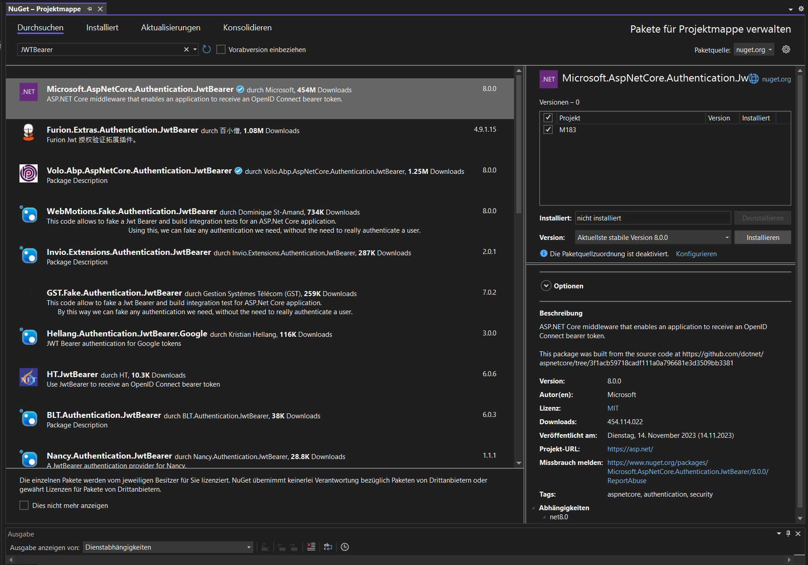
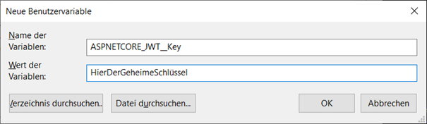

# LB 183 | <br> 🔒 Einblicke in die Welt der Applikationssicherheit 🔒

## **Inhaltsverzeichnis**

- [Einleitung](#einleitung)
- [Handlungsziel 1](#hz1)
  - [Artefakt | Top 3 Sicherheitsrisiken](#artefaktHz1)
    - [Broken Access Control](#brokenAccessControl)
    - [Cryptographic Failures](#cryptographicFailures)
    - [Injection](#injection)
  - [Wie wurde das HZ erreicht](#erreiHz1)
  - [Erklärung Artefakt](#erkläHz1)
  - [Beurteilung Erreichungsgrad](#beurtHz1)
- [Handlungsziel 2](#hz2)
  - [Artefakt | Code vor und nach Implementierung der Massnahme ](#artefaktHz2)
  - [Wie wurde das HZ erreicht](#erreiHz2)
  - [Erklärung Artefakt](#erkläHz2)
  - [Beurteilung Erreichungsgrad](#beurtHz2)
- [Handlungsziel 3](#hz3)
  - [Artefakt | Anleitung zum Erstellen von Authentifizierung und Autorisierung mit JWT ](#artefaktHz3)
    - [Schritt 1 | NuGet-Paket installieren](#artefaktHz3.1)
    - [Schritt 2 | Konfiguration von JWT in Programm.cs](#artefaktHz3.2)
    - [Schritt 3 | Anpassung Login-Controller](#artefaktHz3.3)
    - [Schritt 4 | API Methode anpassen](#artefaktHz3.4)
  - [Wie wurde das HZ erreicht](#erreiHz3)
  - [Erklärung Artefakt](#erkläHz3)
  - [Beurteilung Erreichungsgrad](#beurtHz3)
- [Handlungsziel 4](#hz4)
  - [Artefakt | Anleitung zum Erstellen von Authentifizierung und Autorisierung mit JWT ](#artefaktHz4)
    - [Berücksichtigung während des Entwurfs](#artefaktHz4Entwurf)
    - [Berücksichtigung während der Implementierung](#artefaktHz4Implementierung)
    - [Berücksichtigung während der Inbetriebnahme](#artefaktHz4Inbetriebnahme)
  - [Wie wurde das HZ erreicht](#erreiHz4)
  - [Erklärung Artefakt](#erkläHz4)
  - [Beurteilung Erreichungsgrad](#beurtHz4)
- [Handlungsziel 5](#hz5)
  - [Artefakt | Logging und Auditing](#artefaktHz5)
  - [Wie wurde das HZ erreicht](#erreiHz5)
  - [Erklärung Artefakt](#erkläHz5)
  - [Beurteilung Erreichungsgrad](#beurtHz5)
- [Selbsteinschätzung Modul](#selbsteinschätzungModul)

<a id="einleitung"></a>

## Einleitung

Dieses Repository dient zur Dokumentation der Leistungsbeurteilung des Moduls 183. Diese gliedert sich in fünf Handlungsziele, für die jeweils ein Artefakt erstellt wird, um die Zielerreichung nachweisen zu können. Nachfolgend sind die einzelnen Handlungsziele mit ihrer Gewichtung aufgeführt.

| HZ  | Handlungsziel                                                                                                                                                                           | Gewichtung |
| --- | --------------------------------------------------------------------------------------------------------------------------------------------------------------------------------------- | ---------- |
| 1   | Aktuelle Bedrohungen erkennen und erläutern können. Aktuelle Informationen zum Thema (Erkennung und Gegenmaßnahmen) beschaffen und mögliche Auswirkungen aufzeigen und erklären können. | 10%        |
| 2   | Sicherheitslücken und ihre Ursachen in einer Applikation erkennen können. Gegenmaßnahmen vorschlagen und implementieren können.                                                         | 30%        |
| 3   | Mechanismen für die Authentifizierung und Autorisierung umsetzen können.                                                                                                                | 20%        |
| 4   | Sicherheitsrelevante Aspekte bei Entwurf, Implementierung und Inbetriebnahme berücksichtigen.                                                                                           | 30%        |
| 5   | Informationen für Auditing und Logging generieren. Auswertungen und Alarme definieren und implementieren.                                                                               | 10%        |

<a id="hz1"></a>

# **Handlungsziel 1**

<a id="artefaktHz1"></a>

## Artefakt | Top 3 Sicherheitsrisiken

Als Grundlage für meine Übersicht habe ich den [OWASP Top Ten 2021 Bericht ](https://owasp.org/www-project-top-ten/) verwendet, dieser ist Stand 18.12.2023 die neueste Publikation auf der OWASP Top Ten Webseite.

---

<a id="brokenAccessControl"></a>

### **Broken Access Control (BAC)**

#### **_Was ist es?_**

Wie der Name es schon sagt, handelt es sich bei „Broken Access Control“, um eine kaputte Zugangskontrolle. Das bedeutet, dass UserInnen aufgrund von einer schlechten oder gar nicht vorhandenen Kontrolle sich Zugriff auf Daten oder Funktionen erschleichen, auf die sie keinen Zugriff haben sollten. Die Angriffe können dabei vielfältig sein, ungeschützte API-Endpoints, URLs ohne Kontrolle und noch vieles mehr.

#### **_Was sind die Folgen?_**

Die Folgen von BAC können in ihrem Schaden stark variieren. Von Daten, die eigentlich nicht eingesehen werden sollten, zu ganzen Datenbank, die durch unberechtigten Zugriff gelöscht werden, ist alles dabei.

#### **_Wie erkennt man es?_**

Um eine Software auf BAC zu überprüfen, gibt es hauptsächlich drei Wege:

- **Manuelles Testen** <br>
  Alle Angriffspunkte werden bestimmt (API-Calls, URLs etc.) und anschliessend von Hand getestet, um zu überprüfen, dass keine unautorisierten Zugriffe möglich sind.
- **Automatisches Testen** <br>
  Skript und Tools, welche das Programm automatisch überprüfen, werden eingesetzt. Verbreitete Optionen sind ZAP und Burp Suite.
- **Penetrationstesten** <br>
  Ein White-Hat versucht die Applikation zu hacken und so BAC-Sicherheitslücken zu finden. Diese Testart kann sehr aufwändig und teuer sein, je nachdem aber wichtige Resultate bringen.

#### **_Wie kann man es verhindern?_**

- **Deny by default** <br>
  Wenn es sich nicht um öffentliche Ressourcen handelt, sollte man den Zugriff verweigern und erst nach Verifizierung erlauben.
- **Wiederverwenden von Mechanismen** <br>
  Access Control Mechanismen einmal richtig implementieren und dann in der Applikation wiederverwenden.
- **Zugriff begrenzen** <br>
  Nur eine gewisse Anzahl an API- und Controller-Zugriffen zulassen, um so automatisierte Angriffe stoppen zu können.

---

<a id="cryptographicFailures"></a>

### **Cryptographic Failures (CF)**

#### **_Was ist es?_**

Cryptographic Failures umfassen alle Aspekte der Verschlüsselung und Kryptografie, die ein Risiko darstellen. Dazu gehören die Nichtverschlüsselung von Daten, z.B. beim Senden von HTTP-Anfragen oder beim Speichern in der Datenbank, die Verwendung schlechter/alter Verschlüsselungsalgorithmen, schwache Schlüssel oder sogar Standardschlüssel und noch vieles mehr.

#### **_Was sind die Folgen?_**

Cryptographic Failures können dazu führen, dass vertrauliche Daten veröffentlicht werden und dadurch das Vertrauen in die Anwendung sinkt, was BenutzerInnen dazu veranlasst, auf eine Alternative auszuweichen. Darüber hinaus können Anmeldeinformationen, wenn diese involviert sind, missbraucht werden und, wie im Fall von BAC, dazu verwendet werden, Datenbanken oder andere Systeme anzugreifen und zu beschädigen.

#### **_Wie erkennt man es?_**

- **Daten-Checks** <br>
  Datenbanken überprüfen, sind alle Werte entsprechend geschützt, ggf. DSGVO und andere Gesetzte beiziehen und auf Verstösse prüfen.
- **Verkehr Überwachen** <br>
  Tools wie Wireshark verwenden, um den Datenverkehr der Applikation zu überwachen und möglich gefährdete Daten zu lokalisieren.
- **Versionen prüfen** <br>
  Hash- und Verschlüsselungsalgorithmen auf Aktualität und Sicherheit prüfen.

#### **_Wie kann man es verhindern?_**

- **Konzept für Daten** <br>
  Bei der Planung einer Applikation verschiedene behandelte Daten in Gruppen einteilen, sensible Daten immer verschlüsselt speichern.
- **Unnötige Gefahr vermeiden** <br>
  Sensible Daten nur dann speichern, wenn man auch wirklich muss.
- **Aktualität** <br>
  Immer aktuelle und sichere Algorithmen & Protokolle verwenden.
- **Die Gefahr der Übertragung** <br>
  Daten auch beim Übertragen immer verschlüsseln, da der Verkehr abgehört werden kann.

---

<a id="injection"></a>

### **Injection**

#### **_Was ist es?_**

Um Injection handelt es sich, wenn zusätzlicher Code über Inputs in eine Applikation eingespeist wird, um so ungewollte Aktionen hervorzurufen. Beispielsweise würden bei einer Injection vermeidliche Daten eingegeben werden, da diese jedoch eine spezielle Struktur haben, werden sie vom Programm als Anweisung angesehen und somit ausgeführt.

#### **_Was sind die Folgen?_**

Abgesehen von direktem Schaden an der Datenbank, durch Löschen, Verändern oder Hinzufügen von Daten, können auch hier sensible Daten gestohlen werden, was zu Identitätsdiebstahl (mit Benutzerdaten) und Rufschaden führen kann.

#### **_Wie erkennt man es?_**

- **Struktur prüfen** <br>
  Struktur von Benutzereingaben im eigenen Code prüfen, wird an jeder Stelle verhindert, dass Injections stattfinden können.
- **Automatisierte Suche** <br>
  Wie auch bei BAC, gibt es für Injection Tools, welche die eigene App auf Schwachstellen prüfen. Verbreitete Optionen sind erneut ZAP und Burp Suite.
- **Penetrationstesten** <br>
  Hier gilt das gleiche wie bei BAC Penetrationstests.
  Ein White-Hat versucht die Applikation zu hacken und so
  Injection-Sicherheitslücken zu finden. Diese Testart kann sehr aufwändig und teuer sein, je nachdem aber wichtige Resultate bringen.

#### **_Wie kann man es verhindern?_**

- **Parameterized Statements** <br>
  Anstatt die Daten in das Statement einzufügen, dieses anschliessend zu kompilieren und auszuführen, wird hier das Statement bereits kompiliert und die Daten erst danach eingefügt. So kann verhindert werden, dass die Daten als Anweisung angesehen werden.
- **Whitelisting** <br>
  Diese Variante ergibt nur Sinn, wenn man einen Input hat, welcher eine begrenzte Anzahl an möglichen und bekannten Inputs hat, da man eine Liste von akzeptierten Inputs erstellt und alles andere ablehnt.
- **Escaping** <br>
  Eine weitere bekannte Möglichkeit, um sich vor Injections zu schützen ist Escaping, dabei werden spezielle Zeichen (z.B. Anführungszeichen) in einem gewissen Kontext durch explizite Deklaration unschädlich gemacht. Wichtig zu beachten ist, dass Escaping in einigen Fällen nichts bewirkt. Zum Beispiel sind Zahlen in einer SQL-Abfrage oft nicht in Anführungszeichen, wodurch Escaping von Anführungszeichen hier nicht bringt. Bei dieser Methode ist es daher wichtig, das Escaping auf Sprache und Kontext anzupassen.

<a id="erreiHz1"></a>

## Wie wurde das HZ erreicht

Durch die Erstellung des "Top 3 Sicherheitsrisiken" Berichts habe ich zunächst aktuelle Bedrohungen erkannt, da ich mich beim neusten Top Ten OWASP Bericht über Gefahren informiert habe und weiter habe ich in der folgenden Recherche aktuelle Informationen zu den einzelnen Themen gefunden und so Erkennung der Gefahr, mögliche Gegenmassnahmen sowie Auswirkung der Gefahr jeweils erläutert.

<a id="erkläHz1"></a>

## Erklärung Artefakt

Mein Artefakt, zu diesem Handlungsziel, ist ein Bericht zu den Top 3 Sicherheitsrisiken 2023. Er hat das Ziel, LeserInnen zu erklären, was die drei grössten Sicherheitsgefahren sind, was deren Auswirkungen sind und wie man diese erkennen sowie bekämpfen kann.

<a id="beurtHz1"></a>

## Beurteilung Erreichungsgrad

Hinsichtlich des Moduls würde ich dieses Handlungsziel als vollständig erreicht ansehen, da ich alle gewünschten Punkte berücksichtigt habe. Vom Modul abgesehen ist jedoch zu beachten, dass die gezeigten Risiken nur die drei häufigsten sind und es leider noch ganz viele andere Risiken gibt.

<a id="hz2"></a>

# Handlungsziel 2

<a id="artefaktHz2"></a>

## Artefakt | Code vor und nach Implementierung der Massnahme

Im folgenden Block sehen Sie den Code **vor** der Implementierung der Sicherheitsmassnahme:

```csharp
[HttpPost]
[ProducesResponseType(200)]
[ProducesResponseType(400)]
[ProducesResponseType(401)]
public ActionResult<User> Login(LoginDto request)
{
    if (request == null || request.Username.IsNullOrEmpty() || request.Password.IsNullOrEmpty())
    {
        return BadRequest();
    }

    string sql = $"SELECT * FROM Users WHERE username = '{request.Username}' AND password = '{MD5Helper.ComputeMD5Hash(request.Password)}'";
    User? user= _context.Users.FromSqlRaw(sql).FirstOrDefault();

    if (user == null)
    {
        return Unauthorized("login failed");
    }
    return Ok(user);
}
```

Im folgendem Block sehen Sie den Code **nach** der Implementierung der Sicherheitsmassnahme:

```csharp
[HttpPost]
[ProducesResponseType(200)]
[ProducesResponseType(400)]
[ProducesResponseType(401)]
public ActionResult<User> Login(LoginDto request)
{
    if (request == null || request.Username.IsNullOrEmpty() || request.Password.IsNullOrEmpty())
    {
        return BadRequest();
    }

    string sql = "SELECT * FROM Users WHERE username = {0} AND password = {1}";
    User? user = _context.Users.FromSqlRaw(sql, request.Username, MD5Helper.ComputeMD5Hash(request.Password)).FirstOrDefault();

    if (user == null)
    {
        return Unauthorized("login failed");
    }
    return Ok(user);
}
```

<a id="erreiHz2"></a>

## Wie wurde das HZ erreicht

Um auf die Idee zu kommen, den Code zu überarbeiten und ihn so gegen Injections zu schützen, musste ich ihn zuerst analysieren und die Gefahr sehen, dass gezielten falschen Eingabe das Login überlisten könnten. So habe ich eine Sicherheitslücke (SQL-Injection) und deren Ursache (Eingaben direkt im SQL-Query) erkannt und anschliessend mit dem Vorschlag Parameterized Statements, vorgestellt im HZ1, welchen ich anschliessend implementierte, geschlossen.

<a id="erkläHz2"></a>

## Erklärung Artefakt

Mein Artefakt für das Handlungziel 2 besteht aus dem Code vor und nach der Überarbeitung. <br> <br>
Im Code vor der Überarbeitung ist es möglich, sich in einen Account (egal ob User oder Admin Account) einzuloggen, nur mit dem Wissen, wie der Benutzername lautet, ohne aber das Passwort zu kennen. Gibt es so beispielsweise einen Benutzer mit dem Namen `administrator` so kann man einfach als Benutzername `administrator' --` und als Passwort jeden Wert ausser `NULL` angeben und schon ist man eingeloggt. <br> <br>
Schaut man sich den folgenden Code an, wird klar, warum: <br>

```csharp

string sql = $"SELECT * FROM Users WHERE username = '{request.Username}' AND password = '{MD5Helper.ComputeMD5Hash(request.Password)}'";
User? user= _context.Users.FromSqlRaw(sql).FirstOrDefault();

```

Auf der ersten Zeile wird die SQL-Abfrage definiert, dabei wird der erhaltene Username einfach eingefügt. Die Eingabe `administrator' --` verursacht daher, dass zunächst durch das `'` der String als beendet betrachtet wird und die `--` , welche in SQL anzeigen, dass ein Kommentar kommt, bewirken, dass dieser ganze Code `AND password = '{MD5Helper.ComputeMD5Hash(request.Password)}'"` nicht mehr ausgeführt wird. <br>
In der folgenden Anfrage, an die Datenbank, wird daher einfach nach dem Username gesucht und wenn dieser gefunden wurde der Loginprozess als erfüllt betrachtet und dem bösen Hacker oder der bösen Hackerin wird der Zugang ermöglicht. <br> <br>

Im Code nach der Überarbeitung habe ich Parameterized Statements implementiert: <br>

```csharp

string sql = "SELECT * FROM Users WHERE username = {0} AND password = {1}";
User? user = _context.Users.FromSqlRaw(sql, request.Username, MD5Helper.ComputeMD5Hash(request.Password)).FirstOrDefault();

```

Auf der ersten Zeile, in der SQL-Abfrage, werden daher `username` und `password` mit `{0}` bzw. `{1}` definiert, ohne die richtigen Benutzerdaten einzufügen. In der folgenden Datenbankanfrage werden dabei der eingegebene Username und das eingegebene Passwort als Parameter separat mitgegeben, wodurch die Datenbank weiss, dass diese nur Daten und kein Code sind.

<a id="beurtHz2"></a>

## Beurteilung Erreichungsgrad

Das Handlungsziel 2 würde ich als vollständig erreicht betrachten, ich habe eine Sicherheitslücke gefunden, den Lösungsvorschlag vom HZ1 auf so ein Problem genommen und diesen erfolgreich implementiert. Es ist hinzuzufügen, dass ich jedoch nicht alle Sicherheitsrisiken im Code geschlossen habe. So wird beispielsweise als Hash-Algorithmus, für die Passwörter, MD5 verwendet, welcher als nicht mehr sicher gilt und daher ein Sicherheitsrisiko (Cryptographic Failure) darstellt. Einen möglichen Lösungsansatz, diesen zu schliessen, wäre, in der Applikation einen sicheren Algorithmus wie Argon2 oder Bcrypt zu verwenden.

<a id="hz3"></a>

# Handlungsziel 3

<a id="artefaktHz3"></a>

## Artefakt | Anleitung zum Erstellen von Authentifizierung und Autorisierung mit JWT

<a id="artefaktHz3.1"></a>

### Schritt 1 | NuGet-Paket installieren

NuGet-Packet `Microsoft.AspNetCore.Authentication.JwtBearer` in der eigenen Anwendung installieren:



<a id="artefaktHz3.2"></a>

### Schritt 2 | Konfiguration von JWT in Programm.cs

In der Programm.cs Datei muss das JWT-Paket wie folgt konfiguriert werden:

```csharp

builder.Services.AddAuthentication(options =>
{
    options.DefaultAuthenticateScheme = JwtBearerDefaults.AuthenticationScheme;
    options.DefaultChallengeScheme = JwtBearerDefaults.AuthenticationScheme;
    options.DefaultScheme = JwtBearerDefaults.AuthenticationScheme;
}).AddJwtBearer(o =>
{
    o.TokenValidationParameters = new TokenValidationParameters
    {
        ValidIssuer = builder.Configuration["Jwt:Issuer"],
        ValidAudience = builder.Configuration["Jwt:Audience"],
        IssuerSigningKey = new SymmetricSecurityKey(Convert.FromBase64String(builder.Configuration["Jwt:Key"]!)),
        ValidateIssuer = true,
        ValidateAudience = true,
        ValidateLifetime = true,
        ValidateIssuerSigningKey = true
    };
});

builder.Services.AddAuthorization();

```

Dabei ist es **_wichtig_**, folgende Punkte zu beachten:

- **Using** <br>
  Am Anfang der Datei muss man folgenden beide Using-Anweisungen hinzufügen: <br>
  `using Microsoft.AspNetCore.Authentication.JwtBearer;` & `using Microsoft.IdentityModel.Tokens;`

- **Platzierung des Codes** <br>
  Beim oberhalb gezeigten Code ist es wichtig, diesen vor dem Befehl `var app = builder.Build();` zu platzieren, da der JWT sonst nicht in der App berücksichtigt wird und es zu Fehlern kommen kann.

Nach der Konfiguration sollte die Program.cs ungefähr wie folgt aussehen:

```csharp

using M183.Data;
using Microsoft.EntityFrameworkCore;
using Microsoft.OpenApi.Models;
using Microsoft.AspNetCore.Authentication.JwtBearer;
using Microsoft.IdentityModel.Tokens;


var builder = WebApplication.CreateBuilder(args);

builder.Services.AddDbContext<NewsAppContext>(options =>
    options.UseSqlServer(builder.Configuration.GetConnectionString("SongContext")));

builder.Services.AddControllers();

builder.Services.AddEndpointsApiExplorer();
builder.Services.AddSwaggerGen(c =>
{
    c.SwaggerDoc("v1", new OpenApiInfo { Title = "SwaggerAnnotation", Version = "v1" });
    c.IncludeXmlComments(Path.Combine(System.AppContext.BaseDirectory, "SwaggerAnnotation.xml"));
});

builder.Services.AddAuthentication(options =>
{
    options.DefaultAuthenticateScheme = JwtBearerDefaults.AuthenticationScheme;
    options.DefaultChallengeScheme = JwtBearerDefaults.AuthenticationScheme;
    options.DefaultScheme = JwtBearerDefaults.AuthenticationScheme;
}).AddJwtBearer(o =>
{
    o.TokenValidationParameters = new TokenValidationParameters
    {
        ValidIssuer = builder.Configuration["Jwt:Issuer"],
        ValidAudience = builder.Configuration["Jwt:Audience"],
        IssuerSigningKey = new SymmetricSecurityKey(Convert.FromBase64String(builder.Configuration["Jwt:Key"]!)),
        ValidateIssuer = true,
        ValidateAudience = true,
        ValidateLifetime = true,
        ValidateIssuerSigningKey = true
    };
});

builder.Services.AddAuthorization();

var app = builder.Build();

// Configure the HTTP request pipeline.
if (app.Environment.IsDevelopment())
{
    app.UseSwagger();
    app.UseSwaggerUI();
}

app.UseHttpsRedirection();
app.UseStaticFiles();

app.UseAuthorization();

app.MapControllers();

app.Run();


```

<a id="artefaktHz3.3"></a>

### Schritt 3 | Anpassung Login-Controller

In diesem Schritt wird der Login-Controller so angepasst, dass bei einer erfolgreichen Anmeldung der Client einen JWT-Token vom Server erhält. Diese Anpassung lässt sich in 4 Unterschritte aufteilen.

#### 3.1 | Using-Anweisungen hinzufügen

Wie schon im Programm.cs muss man auch in dieser Datei wieder zwei Using-Anweisungen hinzufügen, dieses Mal die folgenden: <br>
`using System.IdentityModel.Tokens.Jwt;` & `using System.Security.Claims;`

#### 3.2 | Konstruktor anpassen

Im zweiten Schritt müssen wir ein neues privates Feld erstellen und dieses über den Konstruktor mit einem IConfiguration befüllen. <br>

Code **vor** der Konstruktor Änderung:

```csharp

private readonly NewsAppContext _context;

public LoginController(NewsAppContext context)
{
    _context = context;
}

```

Code **nach** der Konstruktor Änderung:

```csharp

private readonly NewsAppContext _context;
private readonly IConfiguration _configuration;

public LoginController(NewsAppContext context, IConfiguration configuration)
{
    _context = context;
    _configuration = configuration;
}

```

#### 3.3 | Methode zum Erstellen von JWT implementieren

Bevor wir im letzten Schritt die Login-Methode so umschreiben können, dass diese JWT-Tokens zurückgeben kann, müssen wir zunächst eine Methode implementieren, welche JWT-Tokens erstellen kann. <br>

Im Folgenden der Code der beschriebenen Methode:

```csharp

private string CreateToken(User user)
{
  tring issuer = _configuration.GetSection("Jwt:Issuer").Value!;
  string audience = _configuration.GetSection("Jwt:Audience").Value!;

  List<Claim> claims = new List<Claim> {
    new Claim(JwtRegisteredClaimNames.Jti, Guid.NewGuid().ToString()),
    new Claim(JwtRegisteredClaimNames.NameId, user.Id.ToString()),
    new Claim(JwtRegisteredClaimNames.UniqueName, user.Username),
    new Claim(ClaimTypes.Role,  (user.IsAdmin ? "admin" : "user"))
  };

  string base64Key = _configuration.GetSection("Jwt:Key").Value!;
  SymmetricSecurityKey securityKey = new SymmetricSecurityKey(Convert.FromBase64String(base64Key));

  SigningCredentials credentials = new SigningCredentials(
  securityKey,
  SecurityAlgorithms.HmacSha512Signature);

  JwtSecurityToken token = new JwtSecurityToken(
    issuer: issuer,
    audience: audience,
    claims: claims,
    notBefore: DateTime.Now,
    expires: DateTime.Now.AddDays(1),
    signingCredentials: credentials
  );

  return new JwtSecurityTokenHandler().WriteToken(token);
}

```

Im ersten Teil der Methode werden zunächst die Claims (im JWT enthaltenen Informationen), sowie andere Einstellungen, wie der zu verwendende Algorithmus und dazugehörige Key, definiert und im zweiten Teil aufgrund dieser Informationen ein Token erstellt.

#### 3.4 | Ändern des Rückgabewerts der Login-Methode

Als letzten Schritt, in diesem Teil, können wir nun noch den Rückgabewert der Login-Methode abändern: <br>

Alter Rückgabewert: `return Ok(user);` <br>

Neuer Rückgabewert: `return Ok(CreateToken(user));`

#### Schritt 3 | Wrap-up

Nachdem wir nun die Login-Controller-Datei überarbeitet haben, sollte sie wie folgt aussehen:

```csharp

using M183.Controllers.Dto;
using M183.Controllers.Helper;
using M183.Data;
using M183.Models;
using Microsoft.AspNetCore.Mvc;
using Microsoft.EntityFrameworkCore;
using Microsoft.IdentityModel.Tokens;
using System.IdentityModel.Tokens.Jwt;
using System.Security.Claims;

namespace M183.Controllers
{
  [Route("api/[controller]")]
  [ApiController]
  public class LoginController : ControllerBase
  {
    private readonly NewsAppContext _context;
    private readonly IConfiguration _configuration;

    public LoginController(NewsAppContext context, IConfiguration configuration)
    {
      _context = context;
      _configuration = configuration;
    }

    /// <summary>
    /// Login a user using password and username
    /// </summary>
    /// <response code="200">Login successfull</response>
    /// <response code="400">Bad request</response>
    /// <response code="401">Login failed</response>
    [HttpPost]
    [ProducesResponseType(200)]
    [ProducesResponseType(400)]
    [ProducesResponseType(401)]
    public ActionResult<User> Login(LoginDto request)
    {
      if (request == null || request.Username.IsNullOrEmpty() || request.Password.IsNullOrEmpty())
      {
        return BadRequest();
      }

      string sql = "SELECT * FROM Users WHERE username = {0} AND password = {1}";
      User? user = _context.Users.FromSqlRaw(sql, request.Username, MD5Helper.ComputeMD5Hash(request.Password)).FirstOrDefault();

      if (user == null)
      {
        return Unauthorized("login failed");
      }
      return Ok(CreateToken(user));
    }

    private string CreateToken(User user)
    {
      string issuer = _configuration.GetSection("Jwt:Issuer").Value!;
      string audience = _configuration.GetSection("Jwt:Audience").Value!;

      List<Claim> claims = new List<Claim> {
        new Claim(JwtRegisteredClaimNames.Jti, Guid.NewGuid().ToString()),
        new Claim(JwtRegisteredClaimNames.NameId, user.Id.ToString()),
        new Claim(JwtRegisteredClaimNames.UniqueName, user.Username),
        new Claim(ClaimTypes.Role,  (user.IsAdmin ? "admin" : "user"))
      };

      string base64Key = _configuration.GetSection("Jwt:Key").Value!;
      SymmetricSecurityKey securityKey = new SymmetricSecurityKey(Convert.FromBase64String(base64Key));

      SigningCredentials credentials = new SigningCredentials(
        securityKey,
        SecurityAlgorithms.HmacSha512Signature
      );

      JwtSecurityToken token = new JwtSecurityToken(
        issuer: issuer,
        audience: audience,
        claims: claims,
        notBefore: DateTime.Now,
        expires: DateTime.Now.AddDays(1),
        signingCredentials: credentials
      );

      return new JwtSecurityTokenHandler().WriteToken(token);
    }
  }
}

```

<a id="artefaktHz3.4"></a>

### Schritt 4 | API-Methode anpassen

Im letzten Schritt passen wir eine API-Delete-Methode so an, dass diese Authentifizierung und Autorisierung durchführt und nur wenn beide erfüllt sind, ein Item gelöscht wird.

Bevor wir uns der Methode widmen, ist es wichtig, am Anfang des Dokuments folgende Using-Anweisungen zu platzieren, damit wir richtig mit dem JWT umgehen können: <br>

```csharp

using Microsoft.AspNetCore.Authorization;
using System.IdentityModel.Tokens.Jwt;
using System.Security.Claims;

```

Nun zu der Delete-Methode, vor der Überarbeitung sieht diese wie folgt aus:

```csharp

[HttpDelete("{id}")]
[ProducesResponseType(200)]
[ProducesResponseType(404)]
public ActionResult Delete(int id)
{
    var news = _context.News.Find(id);
    if (news == null)
    {
        return NotFound(string.Format("News {0} not found", id));
    }

    _context.News.Remove(news);
    _context.SaveChanges();

    return Ok();
}

```

Im ersten Schritt der Überarbeitung fügen wir `[Authorize]` oberhalb von `[HttpDelete("{id}")]`. Dies sorgt dafür, dass die Methode einen Token vom Benutzer verpflichtet und gleichzeitig überprüft, ob dieser Token valid ist (Authentifizierung):

```csharp

[Authorize]
[HttpDelete("{id}")]
[ProducesResponseType(200)]
[ProducesResponseType(404)]
public ActionResult Delete(int id)
{
    var news = _context.News.Find(id);
    if (news == null)
    {
        return NotFound(string.Format("News {0} not found", id));
    }

    _context.News.Remove(news);
    _context.SaveChanges();

    return Ok();
}

```

Im zweiten und letzten Schritt bearbeiten wir den Code so, dass der Beitrag nur entfernt wird, wenn der Call vom Benutzer, der den Beitrag erstellt hat, oder einem Admin stammt (Autorisierung). <br>

Um dies tun zu können, holen wir uns zunächst die UserId und Rolle aus den Claims des Tokens und speichern diese in Variablen: <br>

```csharp

int userId = int.Parse(HttpContext.User.FindFirst(JwtRegisteredClaimNames.NameId)?.Value ?? "0");
string role = HttpContext.User.FindFirstValue(ClaimTypes.Role);

```

Anschliessend bauen wir eine Prüfung ein, wenn die UserId vom Beitrag und Token übereinstimmen oder die Rolle Admin ist, wird der Beitrag aus der Datenbank gelöscht. Werden beide Prüfungen nicht erfüllt, gibt die Funktion einen Status-Code `403 Forbidden` zurück:

```csharp

if (news.Id == userId || role == "admin")
{
    _context.News.Remove(news);
    _context.SaveChanges();
    return Ok();
}
else
{
    return Forbid();
}

```

Setzt man alles zusammen sieht die fertige Methode wie folgt aus:

```csharp

[Authorize]
[HttpDelete("{id}")]
[ProducesResponseType(200)]
[ProducesResponseType(403)]
[ProducesResponseType(404)]
public ActionResult Delete(int id)
{
    var news = _context.News.Find(id);
    if (news == null)
    {
        return NotFound(string.Format("News {0} not found", id));
    }

    int userId = int.Parse(HttpContext.User.FindFirst(JwtRegisteredClaimNames.NameId)?.Value ?? "0");
    string role = HttpContext.User.FindFirstValue(ClaimTypes.Role);

    if (news.Id == userId || role == "admin")
    {
        _context.News.Remove(news);
        _context.SaveChanges();
        return Ok();
    }
    else
    {
        return Forbid();
    }
}

```

Sind Sie allen Schritten gefolgt und hat alles funktioniert, haben Sie nun das Ende der Anleitung erreicht. <br> Herzlichen Glückwunsch, Sie haben nun Authentifizierung und Autorisierung in Ihrer App implementiert.

<a id="erreiHz3"></a>

## Wie wurde das HZ erreicht

Um das Artefakt, die Anleitung, erstellen zu können, musste ich zunächst die Authentifizierung und Autorisierung in der Beispielapplikation umsetzten.

<a id="erkläHz3"></a>

## Erklärung Artefakt

Das Artefakt für dieses Handlungsziel ist eine genaue Schritt-für-Schritt-Anleitung, welche anhand einer Beispielapplikation zeigt, wie man Authentifizierung und Autorisierung umsetzen kann.

<a id="beurtHz3"></a>

## Beurteilung Erreichungsgrad

Das Handlungsziel 3 würde ich als vollständig erreicht sehen. Ich habe mir Mühe gegeben, alle Schritte ganz genau zu erklären und somit zu zeigen, dass ich sowohl Authentifizierung als auch Autorisierung umsetzen kann. Es ist wichtig zu beachten, dass ich in der Beispielapplikation nur eine der News-API-Methoden überarbeitet habe und auch das Frontend der Applikation nicht auf die Änderungen abgestimmt habe. Aus diesem Grund kann man die erstellten Änderungen nur überprüfen, indem man den Server direkt, z.B. mithilfe von Postmann oder einem anderen Tool, anspricht.

<a id="hz4"></a>

# Handlungsziel 4

<a id="artefaktHz4"></a>

## Artefakt | Berücksichtigung von Geheimnisbewahrung während verschiedener Zeitpunkte

<a id="artefaktHz4Entwurf"></a>

### Berücksichtigung während des Entwurfs

Die geplante Beispielapplikation soll ein Open-Source-Projekt werden und somit in einem öffentlichen Repository auf GitHub abgelegt werden. Durch das im Handlungsziel 1 erlangte Wissen habe ich mir aus diesem Grund Gedanken zu Security Misconfiguration gemacht, da bereits geplant wurde, JWT für die Authentifizierung und Autorisierung zu verwenden und ich weiss, dass der verwendete Schlüssel ein Sicherheitsrisiko darstellen kann. Nach genauerem Überlegen bin ich beim Entwurf zum Entschluss gekommen, dass es zwei Lösungen braucht, um den JWT-Key sicher zu bewahren. Einmal für die Implementierung, dass dieser nicht auf dem Repository ersichtlich ist und einmal für die Inbetriebnahme, dass der Key sicher während des Betriebs des Programms abgerufen werden kann. <br>

<a id="artefaktHz4Implementierung"></a>

### Berücksichtigung während der Implementierung

Eine Möglichkeit, den JWT-Key während der Implementierung zu schützen, wäre, die Appsettings.json-Datei in eine Gitignore-Datei aufzunehmen, wenn man jedoch mit anderen Entwicklern zusammenarbeitet, müssen diese auch auf die Appsettings.json-Datei zugreifen können. Aus diesem Grund habe ich nach einem neuen Weg gesucht und bin auf Umgebungsvariablen gestossen. <br>

Für die Implementierung habe ich aus diesem Grund eine Benutzervariable namens `ASPNETCORE_JWT__Key`, mit dem JWT-Key als Wert, auf meinem System erstellt: <br>

 <br>

Wie [ein Video von Study Mash](https://www.youtube.com/watch?v=8zcqGaPwDW0) gut erklärt, kann man, nachdem man die Variabel gesetzt hat, in den Appsettings.json den Key einfach löschen. Das Programm wird nämlich automatisch in den Benutzervariablen suchen, wenn es den Schlüssel nicht direkt in den Appsettings.json gefunden hat. Die Appsettings.json-Datei sieht aus diesem Grund nun wie folgt aus (Beim Teil `Jwt` wurde die Zeile `"Key": hierGeheimerKey` entfernt.): <br>

```csharp

{
  "Logging": {
    "LogLevel": {
      "Default": "Information",
      "Microsoft.AspNetCore": "Warning"
    }
  },
  "AllowedHosts": "*",
  "ConnectionStrings": {
    "SongContext": "Server=(localdb)\\mssqllocaldb;Database=M183InsecureApp;Trusted_Connection=true;MultipleActiveResultSets=true"
  },
  "Jwt": {
    "Issuer": "https://www.bbbaden.ch/",
    "Audience": "https://www.bbbaden.ch/",
  }
}

```

<a id="artefaktHz4Inbetriebnahme"></a>

### Berücksichtigung während der Inbetriebnahme

Nachdem das Programm fertig implementiert wurde und in die Cloud verschoben wird, muss eine neue Lösung her, da die Umgebungsvariablen ja nur auf dem Gerät des Entwicklers oder der Entwicklerin gespeichert sind. Ähnlich wie bei den Umgebungsvariablen gibt es auch bei den verschiedensten Cloud-Diensten die Möglichkeit, kritische Daten wie Keys getrennt vom Code zu speichern. Würde man so beispielsweise das Backend mit dem Azure App Service hosten, könnte man den Azure Key Vault verwenden und dort den JWT-Key speichern.

<a id="erreiHz4"></a>

## Wie wurde das HZ erreicht

Durch die Darstellung meiner Gedanken und Massnahmen zum Umgang mit dem JWT-Key in den verschiedenen Phasen (Entwurf, Implementierung und Inbetriebnahme) habe ich gezeigt, dass ich sicherheitsrelevante Aspekte während allen drei Phasen berücksichtigen kann.

<a id="erkläHz4"></a>

## Erklärung Artefakt

Das Artefakt ist eine Ofenlegung meiner Gedanken und Taten zum Schutz des JWT-Key während den drei Phasen Entwurf, Implementierung und Inbetriebnahme.

<a id="beurtHz4"></a>

## Beurteilung Erreichungsgrad

Ich würde das Handlungsziel 4 als vollständig erreicht betrachten, da ich in allen drei Phasen sicherheitsrelevante Aspekte berücksichtigt habe.

<a id="hz5"></a>

## Handlungsziel 5

<a id="artefaktHz5"></a>

## Artefakt | Logging und Auditing

### Warum Loggen?

Logging in einer Applikation sollte stets sehr ernst genommen werden, wie Platz 9 Security (Logging and Monitoring Failures) der [OWASP Top Ten Liste](https://owasp.org/www-project-top-ten/) zeigt. Schlechtes Logging (z.B. sensible Daten im Log) können dazu führen, dass AngreiferInnen sich Daten beschaffen können, wodurch ihnen neue Angriffsmöglichkeiten eröffnet werden. Kein Logging kann es AngreiferInnen erlauben, Brute-Force-Attacken zu starten, ohne dass der Betreiber etwas davon mitkriegt.

### Generieren von Daten für das Logging

Bei Generieren von Logging Daten sollte man steht darauf achten, die W-Fragen zu beantworten:

- Wann wurde das Log erstellt
- Was zeigt das Log (z.B. Typ des Ereignis)
- Wo wurde das Log erstellt (Datei/Zeile)
- Wer hat das Log ausgelöst (Benutzer/IP-Adresse)
- Was ist passiert (Resultat)

Im Folgenden habe ich zwei Log-Formate für das Login der Beispielapplikation entworfen, einmal für ein erfolgreiches und einmal für ein fehlgeschlagenes Login:

Erfolgreiches Login:

```

2023-12-25T08:15:00Z M183.Controllers.LoginController: Information: login successful for user 'administrator'. Access allowed.

```

Fehlgeschlagenes Login:

```

2023-12-25T08:15:00Z M183.Controllers.LoginController: Warning: login failed for user 'administrator'. Access denied.

```

Die beiden Logs sind im Format [Wann/Wo/WasEreignis/Wer/WasFolge] aufgebaut.

### Implementation von Logging

Die Implementierung vom Logging hat sich in 3 Schritte unterteilt, im Folgenden sehen Sie die Erläuterung dazu:

#### Program.cs anpassen

Im ersten Schritt musste ich in der Program.cs-Datei das Logging konfigurieren. Auch bei diesem Code war es wichtig, ihn vor Build-Command zu platzieren:

```csharp

builder.Host.ConfigureLogging(logging =>
{
    logging.ClearProviders();
    logging.AddConsole(); // Console Output
    logging.AddDebug(); // Debugging Console Output
});

```

#### Logging in den Konstruktor des Login-Controller nehmen

Wie schon im Handlungsziel 3, für den JWT, musste ich auch hier das Logging in den Konstruktor aufnehmen und in ein privates Feld speichern:

```csharp

private readonly ILogger _logger;
private readonly NewsAppContext _context;
private readonly IConfiguration _configuration;

public LoginController(ILogger<LoginController> logger, NewsAppContext context, IConfiguration configuration)
{
  _logger = logger;
  _context = context;
  _configuration = configuration;
}

```

#### Logging dem Login hinzufügen

Im letzten Schritt habe ich den im vorherigen Schritt übergebenen Logger verwendet, um das Loggen der beiden im ersten Schritt definierten Nachrichten zu implementieren.

Login-Methode **vor** der Überarbeitung:

```csharp

[HttpPost]
[ProducesResponseType(200)]
[ProducesResponseType(400)]
[ProducesResponseType(401)]
public ActionResult<User> Login(LoginDto request)
{
    if (request == null || request.Username.IsNullOrEmpty() || request.Password.IsNullOrEmpty())
    {
        return BadRequest();
    }

    string sql = "SELECT * FROM Users WHERE username = {0} AND password = {1}";
    User? user = _context.Users.FromSqlRaw(sql, request.Username, MD5Helper.ComputeMD5Hash(request.Password)).FirstOrDefault();

    if (user == null)
    {

        return Unauthorized("login failed");
    }

    return Ok(CreateToken(user));
}

```

Login-Methode **nach** der Überarbeitung:

```csharp

[HttpPost]
[ProducesResponseType(200)]
[ProducesResponseType(400)]
[ProducesResponseType(401)]
public ActionResult<User> Login(LoginDto request)
{
    string timeStampRequest = DateTime.UtcNow.ToString("yyyy-MM-ddTHH:mm:ssZ");

    if (request == null || request.Username.IsNullOrEmpty() || request.Password.IsNullOrEmpty())
    {
        _logger.LogWarning($"{timeStampRequest}  M183.Controllers.LoginController: Warning: login failed for user '{request.Username}'. Access denied.");
        return BadRequest();
    }

    string sql = "SELECT * FROM Users WHERE username = {0} AND password = {1}";
    User? user = _context.Users.FromSqlRaw(sql, request.Username, MD5Helper.ComputeMD5Hash(request.Password)).FirstOrDefault();

    if (user == null)
    {
        _logger.LogWarning($"{timeStampRequest}  M183.Controllers.LoginController: Warning: login failed for user '{request.Username}'. Access denied.");
        return Unauthorized("login failed");
    }
    _logger.LogInformation($"{timeStampRequest}  M183.Controllers.LoginController: Information: login successful for user '{request.Username}'. Access allowed.");
    return Ok(CreateToken(user));
}

```

Im oberhalb gezeigten Code speicher ich als Erstes mit `string timeStampRequest = DateTime.UtcNow.ToString("yyyy-MM-ddTHH:mm:ssZ");` den Timestamp der Anfrage in einer Variabel. Diese kann ich dann in der Log-Nachricht verwenden.

`_logger.LogWarning($"{timeStampRequest}  M183.Controllers.LoginController: Warning: login failed for user '{request.Username}'. Access denied.");` gibt ein Warnungslog aus, wobei `{timeStampRequest}` der am Anfang gespeicherte Timestamp ist und `{request.Username}` der Username, welcher für das Login mitgegeben wurde.

Für ein erfolgreiches Login ist das Log sehr ähnlich, nur wird hier eine Information geloggt und das Resultat ist erlaubt, statt verweigert:

`_logger.LogInformation($"{timeStampRequest}  M183.Controllers.LoginController: Information: login successful for user '{request.Username}'. Access `

### Auditing Erklärung

Im Vergleich zum oben gezeigten Loggen ist Auditing dafür gedacht, Aktionen/Veränderungen zu dokumentieren und zu speichern, um so im Nachhinein nachweisen zu können, wer Datensätze erstellt, verändert oder gelöscht hat. In manchen Bereichen, z.B. im Gesundheits- oder Finanzwesen, gibt es gesetzliche Vorgaben, welche vorgeben, dass Audit Trails erfasst werden müssen.

### Generieren von Daten für das Auditing

Für das folgende Beispiel habe ich eine imaginäre Post-Datenbank erstellt. In dieser werden Posts mit einer Id, einem Post-Titel und dem Post-Text gespeichert. Hier beispielhafte Datensätze:

| Id  | postTitle        | postText        |
| --- | ---------------- | --------------- |
| 1   | Update is coming | bla bla bla bla |
| 2   | Stay tuned       | bla bla bla bla |

Um Veränderungen an einer solchen Tabelle nachweisen zu können würde man nun in der Realität eine zweite Datenbank erstellen und dort folgende Tabelle haben, welche Veränderungen dokumentiert.

| id  | timestamp            | action | postId | postTitle      | postText | changed-By |
| --- | -------------------- | ------ | ------ | -------------- | -------- | ---------- |
| 1   | 2023-12-25T08:15:00Z | UPDATE | 1      | Update is here | NULL     | jan.lehner |
| 2   | 2023-12-25T08:19:00Z | DELETE | 2      | NULL           | NULL     | jan.lehner |

#### Auswertung und Alarme implementieren

Sowohl die Daten vom Logging als auch die vom Auditing kann man, nach erfassen, analysieren und je nach Inhalt weitere Aktionen ausführen.

Wurde beispielsweise ein Log definiert, welches ausgelöst wird, wenn ein Angriff auf die Applikation stattfindet, so kann man einen Alarmmechanismus implementieren, welcher eine verantwortliche Person unverzüglich per Mail, SMS oder andere Kanäle informiert.

Auch für die Weiterentwicklung einer Applikation kann das Analysieren von Logs sehr hilfreich sein. So kann man Teile der Applikation finden, die fehleranfällig sind oder bei denen für die BenutzerInnen nicht klar ist, was sie machen müssen und es so oft zu Logs kommt. Mit den erhaltenen Informationen kann man neue Ideen und Optimierungen ausarbeiten und auf längere Sicht die Applikation stetig optimieren.

<a id="erreiHz5"></a>

## Wie wurde das HZ erreicht

Durch die praktische Umsetzung des Logging und dem Erklären des Auditings anhand eines Beispiels habe ich gezeigt, wie man Informationen zu beidem generieren kann.

Des Weiteren habe ich erläutert, wofür die Auswertung und Alarme sind und wie man diese theoretisch implementieren kann. 

<a id="erkläHz5"></a>

## Erklärung Artefakt

Mein Artefakt ist eine Erklärung zu den Themen Logging und Auditing, sowie die dazugehörige Auswertung und Festlegung von Alarmen. 

<a id="beurtHz5"></a>

## Beurteilung Erreichungsgrad

Das Handlungsziel 5 würde ich als vollständig erreicht betrachten. Zwar habe ich das Auditing und die Auswertung/Alarme nicht implementiert, da wir das aber nicht im Modul behandelt haben, gehe ich davon aus, dass meine Erläuterungen und Gedanken zu den einzelnen Punkten reichen. 

<a id="selbsteinschätzungModul"></a>

# Selbsteinschätzung Modul
Rückblickend auf das Modul bin ich mit meinen Leistungen sehr zufrieden. Während der Bearbeitung gab es einzelnen Punkte, die mir zunächst unklar waren, bei diesen habe ich jedoch entweder die Lehrperson um Hilfe gebeten oder mich selbst zum Thema schlau gemacht, bis ich es verstanden habe. Aus diesem Grund würde ich sagen, dass ich alle Kompetenzen erreicht habe, mit Ausnahme des Auditings. Dieses habe ich zwar in der Theorie verstanden, jedoch hat die Zeit nicht gereicht und dadurch hat mir das Wissen gefehlt, wie man die Beispielapplikation damit erweitern kann. Da wir den Auftrag dazu jedoch nicht im Unterricht bearbeitet haben, würde ich es nicht als Problem für die Erreichung des Moduls betrachten, sondern mehr als ein Thema, über das ich mich in Zukunft noch weiter informieren werden. Zusammengefasst bin ich der Meinung, die erarbeiteten Themen verstanden und alle Ziele der Leistungsbeurteilung abgedeckt zu haben.